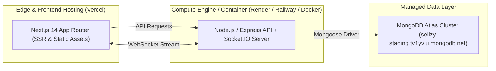

# Deployment Architecture — FleetOS

```mermaid
flowchart LR
    subgraph Vercel ["Edge & Frontend Hosting (Vercel)"]
        NextApp["Next.js 14 App Router (SSR & Static Assets)"]
    end

    subgraph CloudEngine ["Compute Engine / Container (Render / Railway / Docker)"]
        NodeServer["Node.js / Express API + Socket.IO Server"]
    end

    subgraph DataCloud ["Managed Data Layer"]
        Atlas["MongoDB Atlas Cluster (sellzy-staging.tv1yvju.mongodb.net)"]
    end

    NextApp -->|API Requests| NodeServer
    NextApp <-->|WebSocket Stream| NodeServer
    NodeServer -->|Mongoose Driver| Atlas
```

